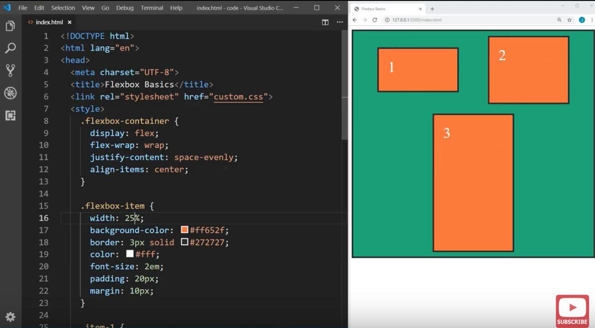

# What is Flexbox
- layout mode in CSS3 that provides more efficient way to lay out, align and distribute space among items in a container
- before flexbox:
    - *block* layout for documents, *inline* layout for text, *positioned* layout for explicit positioning, *table* layout for 2D tabular data

# Centering elements within div
- This is how you center a child element perfectly within a container div
```css
div.container {
    display: flex;
    justify-content: center;
    align-items: center;
}
```
- this will center the child element of `div.container` along both horizontal and vertical axes

# Parent container
```css
div.flexbox-container {
    display: flex;
}
```
will create a flexbox container and put every child element into one row. Glexbox is orientated row-based (horizontally) by default. The horizontal axis = the **main axis**. The other axis = the **cross axis**. e.g. if the main axis is the horizontal axis then the cross axis is the vertical axis and vice versa.
- Adding `justify-content: flex-end;` will align everything along the *main axis* towards the opposite side (e.g. right side for horizontal axis)
    - default is `flex-start`
    - use `center` to center child elements
    - use `space-between` to have child elements be spaced to fill the container along the main axis
        - all empty space is distributed between the child elements
    - use `space-around` to have spacing distributed on both sides of child elements (not just between them)
    - use `space-evenly` evenly space all child elements within the parent container
- Adding `align-items: <value>;` to change how child elements are space along the cross-axis
    - default is `stretch`: child elements will stretch to fill space along the cross-axis
    - use `flex-start` to align child elements to start of cross-axis (e.g. top if it's the vertical axis)
    - use `flex-end` to align to other end of cross-axis
    - also `center` and `space-<between/around/evenly>` as above
- `flex-wrap: wrap;` will allow child elements to wrap around to fill another row/column (depending on main axis) if they are too big
    - in the image below, the main axis is the horizontal axis. The 3 containers (`.flexbox-item`s) have width 25% and the 3rd box doesn't have the space on its row => it wraps around to another row
    
    - With flex wrap on, if we do:
        - `align-content: center;` it will align the entire group as a unit (i.e. all child elements) within the container
            - has same values as `justify-content`
        - `align-items` aligned each child element *with respect to each other*
- `flex-direction: column` to change the main axis to the vertical direction
    - default `row` (horizontal direction)
- `flex-flow` is a combo rule for `flex-direction` and `flex-wrap`
    - e.g. `flex-flow: column wrap;` = `flex-direction: column; flex-wrap: wrap;`

# Child elements
- `flex-grow: 1` child element will grow to fill any extra space along the main axis
    - if you set this on multiple child elements => they will evenly grow to fill extra space along the parent container's main axis
    - the value you give = the relative weight of extra space that this child element should take up (i.e. increasing to `flex-grow: 2` will make this child element take up 2x the extra space as those with `flex-grow: 1`)
    - activates when child elements don't completely take up the main axis space of parent container
- `flex-shrink: 1` will shrink child element along main axis when there is not enough space in the parent container (or when the parent container shrinks along the main axis)
- `flex-basis: 25%;` = size of child element along the main axis
    - if the main axis = horizontal direction => this is the same as `width: 25%;`
- `flex` is a combo rule for `flex-grow, shrink, basis`
    - `flex: 1 1 15%;` = `flex-grow: 1; flex-shrink: 1; flex-basis: 25%;`
- `align-self: center`
    - specify alignment of ONLY this child element along the cross-axis (remember default is `stretch`)
- NOTE: these rules are only visible on child elements when parent rules like `flex-wrap` or `justify-content` don't exist (since they take precendent)
- `order: <#>`
    - can actually reorder child elements along main axis
    - ascending order (i.e. 1 is 1st along the main axis, 2 is 2nd, 3 is 3rd, etc.)
