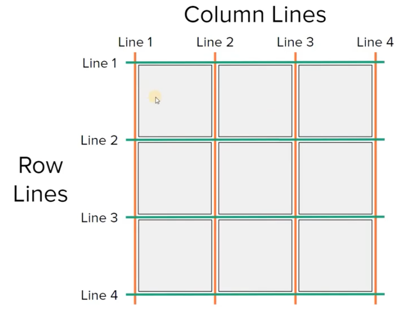
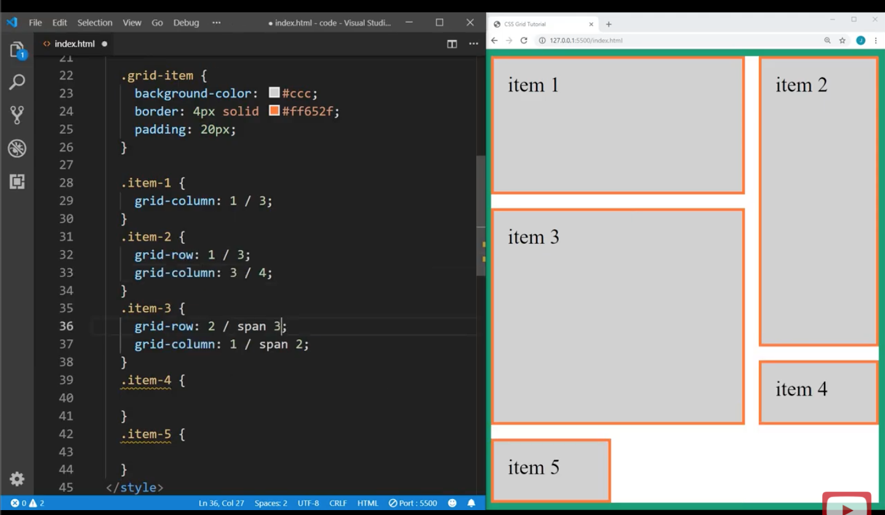
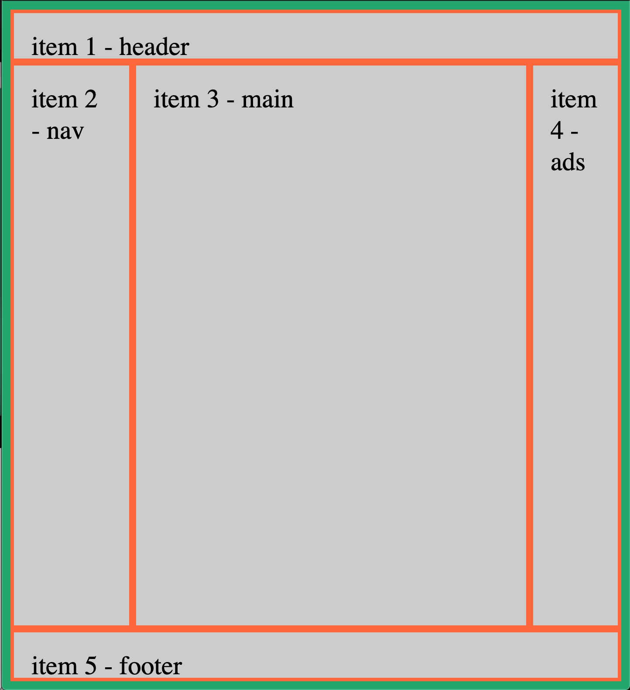

- A more powerful version of Flexbox; whereas flexbox is 1D (along major axis), grid is 2D (along both axes)

- **Container** wraps the grid items
    - rows and cols are defined by lines
    - each block shown in the image above is a **grid cell**
    - a single row/col of cells is called a **track**
    - an **area** is a rectangle block of cells
    - i.e. if we want an item to span 2 grid cells, then tell it to start at line 1 and end at line 3 

# Grid container
- To make a container a grid: `display: grid` on its CSS
- `grid-template-columns: 1fr 1fr 1fr;` to have each row have 3 columns each taking up equal width
    - `fr` = fractional unit
        - relative unit => to have column 2 take up twice the width of col's 1 and 3 do `grid-template-columns: 1fr 2fr 1fr;`
    - can also use % or px
    - `grid-template-columns: repeat(n, 1fr)` will create n columns each taking up equal width
- `grid-template-rows` to define size of each row
    - `grid-template-rows: 100px 100px;` will make the first 2 rows each take up 100px of height
    - the rest of the rows have implicit height set to fill up the remaining container height
        - `grid-auto-rows: 200px` will set the remaining rows to a default height of 200px
- `justify-items` will determine the justification of each grid item within its cell horizontally
    - default is `stretch` to fill the cell
    - `center`
    - `start`
    - `end`
- `align-items` will determine the justification of each grid item within its cell vertically
    - same values as above
- `justify-content` will determine the justification of the entire grid (as one block) within the container horiziontally
    - same values as above 
    - plus `space-around`, `space-between`, `space-evenly`
- `align-content` will determine the justification of the entire grid within the container vertically
    - same values as above
- `grid-row-gap: 20px` specifies the spacing between rows to be `20px
- `grid-column-gap`
- `grid-gap` is a combo rule for row and col gaps 
    - e.g. `grid-gap: 10px 20px;` puts 10px between rows and 20px between cols
    - e.g. `grid-gap: 20px;` puts 20px between both rows and cols

# Grid item

- `grid-column-start: 1; grid-column-end: 3;`
    - will have the grid item span column 1 and 2 in its row
    - i.e. the end is exclusive here
- `grid-column: 1 / 3;` will start at column 1 and end at 3 (i.e. same as above 2 rules)
    - `grid-column: 1 / span 2` will tell the item to span 2 columns (without specifying end column)
- `grid-area: 1 / 3 / 3 / 4` is a super-combo rule combining them all
    - row start, col start, row end, col end
- you can have grid items **overlap** each other (e.g. item 4 in image above)
    - set `z-index` to determine display order of overlap (i.e. which grid item is displayed over the others)
- `justify-self` and `align-self` to justify just this grid item within its grid cell (horizontally and vertically respectively)
- `place-self` is combo rule (align, justify)
    - `place-self: start center;` will align item at start of its grid cell vertically and justify it to the center horizontally within its grid cell

# Laying out the grid using named areas

```css
.grid-container {
    height: 100vh;
    border: 10px solid #14a76c;
    display: grid;
    
    grid-template-areas: 
        "header header header"
        "nav main ads"
        "footer footer footer";
    grid-template-rows: 60px 1fr 60px;
    grid-template-columns: 20% 1fr 15%;
    /*
        combo rule:
        grid-template: 
            "header header header" 60px
            "nav main ads" 1fr
            "footer footer footer" 60px 
            / 20% 1fr 15%;

        grid-template: 
            "header header header header" 60px
            "nav main . ads" 1fr
            "footer footer footer footer" 60px 
            / 20% 1fr 50px 15%;
        to add an empty cell between main and ads that spans 50px
    */
}
.item-1 {
    grid-area: header;
}
.item-2 {
    grid-area: nav;
}
.item-3 {
    grid-area: main;
}
.item-4 {
    grid-area: ads;
}
.item-5 {
    grid-area: footer;
}
```