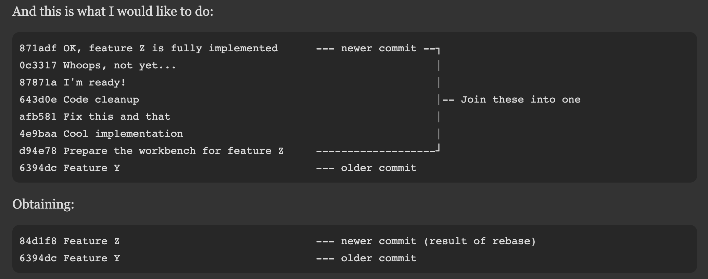

# Git

- [Git](#git)
	- [Initialize remote with local](#initialize-remote-with-local)
		- [Unitialize repo](#unitialize-repo)
	- [Basic Workflow](#basic-workflow)
		- [Create new branch and keep up to date with masters](#create-new-branch-and-keep-up-to-date-with-masters)
		- [Merge with master](#merge-with-master)
		- [Delete new feature branch](#delete-new-feature-branch)
		- [See branch diffs](#see-branch-diffs)
	- [Squashing commits](#squashing-commits)
	- [Merging](#merging)
		- [Merge specific files from another branch](#merge-specific-files-from-another-branch)
		- [Merge only certain commits](#merge-only-certain-commits)
	- [Revert to previous commit](#revert-to-previous-commit)
	- [Remove file/folder from being tracked](#remove-filefolder-from-being-tracked)
	- [Branches](#branches)
	- [Diffs](#diffs)
	- [Going back to previous commit, making changes => pushing new state to origin](#going-back-to-previous-commit-making-changes--pushing-new-state-to-origin)
	- [Remotes](#remotes)
		- [Changing remote URL](#changing-remote-url)
		- [Fetching from remote](#fetching-from-remote)
		- [Set up remote tracking for other branches](#set-up-remote-tracking-for-other-branches)
	- [Git LFS](#git-lfs)
	- [Submodules (nested Git repos)](#submodules-nested-git-repos)

## Initialize remote with local

1. commit local
2. `git remote add origin git@github.com:jthefang/HeartCraft.git`
3. `git pull origin master --allow-unrelated-histories`
4. `git push origin master`

### Unitialize repo

- `rm -rf .git`

## Basic Workflow

### Create new branch and keep up to date with masters
1. `git checkout -b [new feature branch]`
2. Do work => add, commit, push
3. `git push -u [origin <branch>]`
   - push new branch to remote
4. `git rebase [origin/master]`
   - incorporate this branches features on top of masters 

### Merge with master
- `git checkout master`
- `git merge [new feature branch]`
- now master has the new feature changes
- `git push [origin master]`
- send new changes to remote

### Delete new feature branch

- `git branch -d [branch-name]`
- `git push --delete <remote_name> <branch_name>`

### See branch diffs

- `git diff master…[branch-name]`
  - to see diffs between master branch and branch `[branch-name]`

## Squashing commits 
- See [link](https://www.internalpointers.com/post/squash-commits-into-one-git)

- `git rebase -i 6394dc`
  - the hash = hash of the commit that is immediately BEFORE the first commit in the bundle of commits you want to squash 
- in the interactive editor, mark everything except the first as s (leave the first commit as pick)
  - `Ctrl-O`, `Enter`, `Ctrl-X` in nano to save and exit
- then it’ll ask you for a commit message for the squashed commits (default = list of all the squashed commits’ messages)
- `git rebase --abort`
  - to abort a rebase

## Merging

### Merge specific files from another branch

- `git checkout [branch you want new file to merge into]`
- `git checkout [other branch] [other branch’s file]`

### Merge only certain commits

- `git cherry-pick -x hash-of-commit`

## Revert to previous commit

- `git reset —hard [commit id]`
    - reverts to commit, deletes all uncommitted changes (BE CAREFUL DOING THIS)
    - `git push -f [origin master]`
        - to reset remote
- `git checkout [commit id]`
	- branches you to that commit so you can fool around
	- `git checkout [branch]` to go back (e.g. branch = master)
- `git checkout -- [filename]`
	- reverts changes in specific file to previous commit’s

## Remove file/folder from being tracked

- `git rm -r --cached <folder>`
- `git clean -fd`
    - removes untracked files (f) and directories (d)
- `git reset [file]`
	- untracks file
- Add folders to git ignore if you don’t want git to even pick up their changes

## Branches

- `git checkout [branch-name]`
- `git checkout -b [branch-name] [sha1-of-commit or HEAD~3]`
	- creates a branch from a commit and checks it out
- `git push -u origin <branch>`
	- push local branch to remote and set up tracking for it
- `git branch -D [branch-name]`
	- deletes branch
- `git push --delete <remote_name> <branch_name>`
	deletes branch on remote
- `git remote prune origin --dry-run`
  - lists branches that can be pruned/deleted on local
  - run without `--dry-run` to actually delete them

## Diffs

- `git diff (before you commit)`
	- `—cache`: after you git add
	- `—word-diff`: 
- `git diff branch_1..branch_2`
	- differences between 2 branches
- `git diff master~20:pom.xml pom.xml`
	- compare current version of pom.xml to master from 20 revisions ago
- `git show`
- `git push --force`
	- to override previous commits with your local state
- `git diff --compact-summary --diff-filter=M [staff/master...task3]`
	- compare number of lines changed in Modified files only between staff/master branch and the task3 branch

## Going back to previous commit, making changes => pushing new state to origin

1. `git checkout [previous commit]`
2. `git branch temp`
3. `git checkout temp`
4. `git branch -f [og branch] temp`
5. `git checkout [og branch]`
6. `git push -f origin [og branch]`

## Remotes 

- `git remote -v` 
  - to list remote URLS
- to show more info:
  - `git config --get remote.origin.url`
  - `git remote show origin` (more info)

### Changing remote URL

- `git remote set-url origin [new url]`

### Fetching from remote

- `git fetch --all`
- `git reset —hard origin/[branch name]`
	- to force override repo with remote state (does not affect untracked files)

### Set up remote tracking for other branches 

- `vim .git/config`
```
[remote "origin"]
	...
	fetch = +refs/heads/*:refs/remotes/origin/*
```
    - by default when you clone a repo it only sets up tracking for the master branch, you want to also have it fetch tracking for all branches

## Git LFS

- Use git LFS for large files
- `git lfs install`
    - have to do this in every repo you want Git LFS for
- `git lfs track "*.csv"`
- `git add [csv files]`
    - => commit/push

## Submodules (nested Git repos)

- Reference this [note](https://chrisjean.com/git-submodules-adding-using-removing-and-updating/)
- `git submodule add <git link> dir-to-add-submodule/`
- `git checkout --recurse-submodules`
	- makes sure all submodules are up to date
- `git submodule add <abs or relative URL of subrepo>`
	- e.g. `git submodule add https://github.com/chaconinc/DbConnector`
	- e.g. `git submodule add ./Sp19HW1/ (subdirectory)`
	- add git repo as submodule to your root repo
