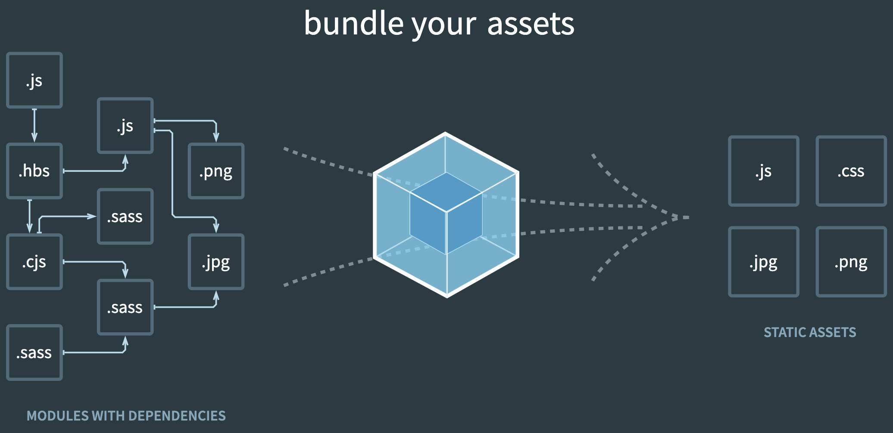

# Webpack

- Based off Colt Steele's tutorial series: https://www.youtube.com/watch?v=3On5Z0gjf4U&list=PLblA84xge2_zwxh3XJqy6UVxS60YdusY8

- Webpack takes files of different types (scripts, images, styles) and bundles them into just a few files 
- Also manages dependencies 
- Webpack is responsible for bundling React apps into just a few build files (`npm run build`)
  - minifies CSS and JS files in production
  - it also does this in the development mode (`npm start`); bundles css into the JS files
- Reference this [repo](https://github.com/Colt/webpack-demo-app)

## Installing/running webpack

